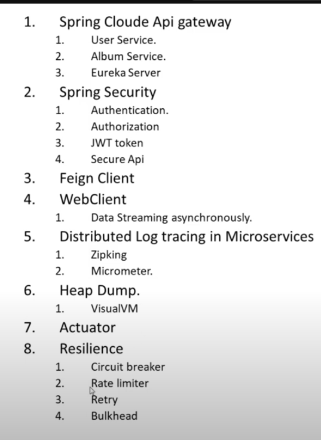
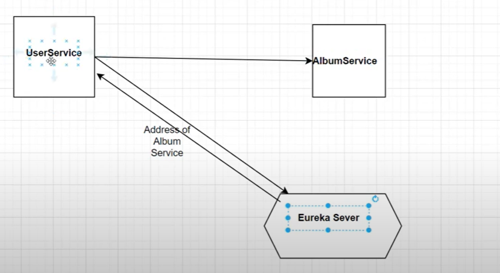

## Spring Boot Microservice



### confuguring the eureka server
🟨 What is Eureka Server?
  - Eureka Server is like a phone book for your microservices.
  - It keeps track of all your microservices: who they are, where they live (IP & port), and whether they're running.
  - Other services can register themselves with Eureka.
  - Services can also ask Eureka for the location of other services.
- This allows microservices to find and talk to each other without hardcoding IP addresses

- simple flow



- Note 
  - The settings register-with-eureka: false and fetch-registry: false are 
  - particularly important because they prevent the server from 
  - trying to register with itself and attempting to fetch the 
  - registry, which is necessary when running a standalone Eureka server.


## Services
```text
user service
    - web, eureka client
  - 8081
  
  
Eureka service
    - eureka server
  - 8761

```


- Note
- you will realise that we can call the userservice 
  - both ways

```text
directly
http://localhost:8081/user/status-check

or 

via the eureka server
http://desktop-c0oig6m.mshome.net:8081/user/status-check
```