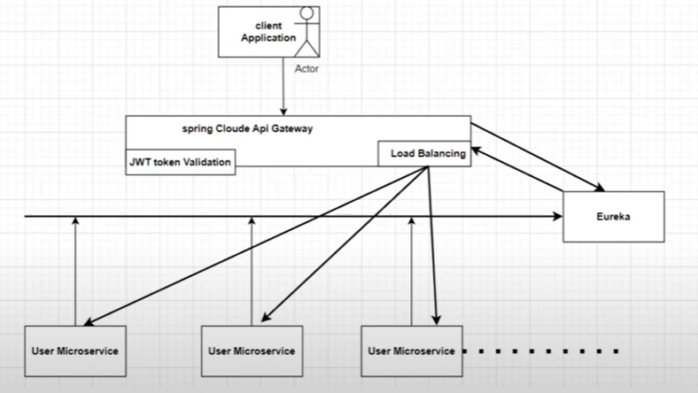
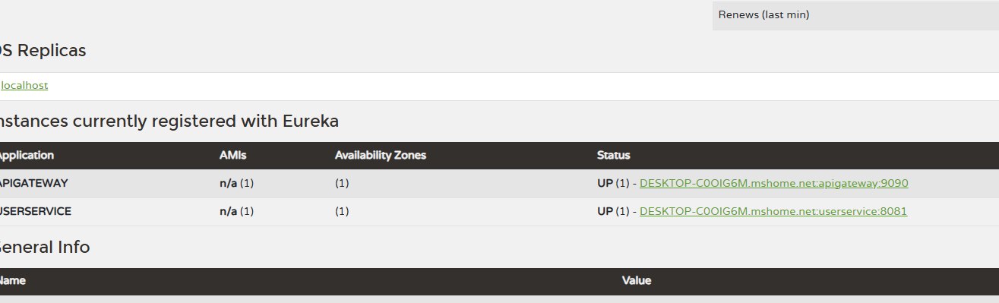

## Spring Boot Microservice


### confuguring the eureka server
🟨 What is Eureka Server?
  - Eureka Server is like a phone book for your microservices.
  - It keeps track of all your microservices: who they are, where they live (IP & port), and whether they're running.
  - Other services can register themselves with Eureka.
  - Services can also ask Eureka for the location of other services.
- This allows microservices to find and talk to each other without hardcoding IP addresses

- simple flow


- Note 
  - The settings register-with-eureka: false and fetch-registry: false are 
  - particularly important because they prevent the server from 
  - trying to register with itself and attempting to fetch the 
  - registry, which is necessary when running a standalone Eureka server.


## Services
```text
user service
    - web, eureka client
  - 8081
  
  
Eureka service
    - eureka server
  - 8761

```


- Note
- you will realise that we can call the userservice 
  - both ways

```text
directly
http://localhost:8081/user/status-check

or 

via the eureka server
http://desktop-c0oig6m.mshome.net:8081/user/status-check
```

### spring cloud api gateway



- create a spring boot project
  - depend: cloud gateway (remove the mvc), reactive web, eureka client


- automatic mapping of api gateway route
```text
    gateway:
      discovery:
        locator:
          enabled: true
```

- making request to the user service through the api gateway




#### manual routing

- Note

```text

in the api gateway, we dont need this now 
        locator:
          enabled: true
          lower-case-service-id: true

```

```text

By default, Spring Cloud Gateway can route automatically using Eureka service names (like http://USERSERVICE/...), but manual routing gives you:
- Fine-grained control over paths (/userservice/**, /orderservice/**, etc.)
- The ability to rewrite paths
- Custom filters per route (rate limiting, auth, logging)
- Easier debugging and documentation
- Support for fallback and retry configurations
```